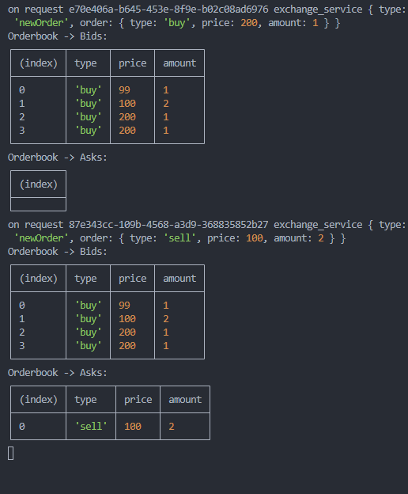

# This is a simple exchange service in NodeJS

Let's go!

## Runtime

For this challengue I'm using FNM (Fast Node Manager) with NodeJS 20.16.0

## Setup

```bash
npm install
```

## Start DHT

Start 2 Grapes from Grenache

``` bash
npx grape --dp 20001 --aph 30001 --bn '127.0.0.1:20002'
npx grape --dp 20002 --aph 40001 --bn '127.0.0.1:20001'
```

## To use

This node asume rol as a client and server.
Each node can be receive orders from the other node.

* Run node with parameters: `peer.js <type> <price> <amount>` such as:

Datatypes:
- type: 'buy' or 'sell'
- price: number
- amount: number

```bash
node peer.js buy 10 100
```

```bash
node peer.js sell 10 100
```

## Image


Developed with ❤️ from Jorge Bizarro

